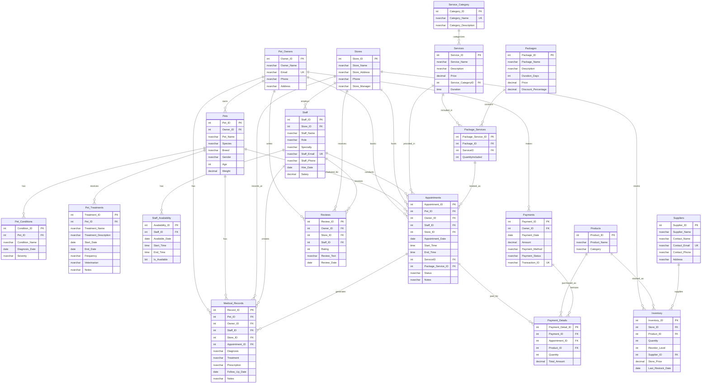

# 🐾 Pawfect Pet Care Database System

This is a comprehensive relational database design for veterinary clinic management that integrates both clinical operations and retail functionality.

## 📋 Table of Contents
- [Project Overview](#project-overview)
- [Database Schema](#database-schema)
- [Features](#features)
- [Installation](#installation)
- [Database Structure](#database-structure)
- [Sample Queries](#sample-queries)
- [Future Enhancements](#future-enhancements)
- [Contributing](#contributing)

## 🎯 Project Overview

Pawfect Pet Care is a veterinary clinic database system designed to manage:
- **Clinical Operations**: Medical records, appointments, treatments, staff scheduling
- **Retail Operations**: Inventory management, product sales, supplier relationships
- **Business Management**: Multi-location support, payment processing, customer reviews

This database could serve as the foundation for future digital tools including appointment booking apps and inventory management dashboards.

## 🗃️ Database Schema

The database consists of **20 normalized tables** with proper relationships and constraints:

### Entity Relationship Diagram



*Database schema visualization created with [Mermaid](https://mermaid.js.org/)*

### Core Tables:
- **Stores** - Multi-location management
- **Pet_Owners** - Customer information
- **Pets** - Pet profiles and basic info
- **Staff** - Employee management with roles
- **Appointments** - Scheduling system
- **Medical_Records** - Clinical history
- **Services** - Available treatments and procedures
- **Products** - Retail inventory items
- **Payments** - Transaction processing

### Supporting Tables:
- Pet_Conditions, Pet_Treatments, Staff_Availability
- Service_Category, Packages, Package_Services
- Inventory, Suppliers, Payment_Details, Reviews

## ✨ Features

### Clinical Management
- 🏥 Complete medical record tracking
- 📅 Appointment scheduling with staff availability
- 💊 Treatment and medication management
- 🔄 Follow-up care scheduling

### Retail Operations  
- 📦 Inventory management across multiple locations
- 🏪 Supplier relationship tracking
- 💰 Point-of-sale integration
- 📊 Automated reorder level monitoring

### Business Intelligence
- 📈 Revenue tracking and reporting
- ⭐ Customer review system
- 👥 Staff performance management
- 🎁 Service packages with discounts

## 🚀 Installation

### Prerequisites
- Microsoft SQL Server (2016 or later)
- SQL Server Management Studio (SSMS) or similar client

### Setup Instructions

1. **Clone the repository**
   ```bash
   git clone https://github.com/mimihagisama/pawfect-pet-care-database.git
   cd pawfect-pet-care-database
   ```

2. **Create the database**
   ```sql
   -- Run in SQL Server Management Studio
   -- Execute the complete script: pawfect_pet_care_database.sql
   ```

3. **Verify installation**
   ```sql
   USE Pawfect_Pet_Care;
   SELECT COUNT(*) as TableCount 
   FROM INFORMATION_SCHEMA.TABLES 
   WHERE TABLE_TYPE = 'BASE TABLE';
   ```

## 🏗️ Database Structure

### Entity Relationship Overview
```
Pet_Owners (1:M) Pets (1:M) Appointments (M:1) Staff
     |                         |                    |
     |                   Medical_Records            |
     |                         |            Staff_Availability
     |                    Pet_Conditions            |
     |                    Pet_Treatments       (M:1) Stores
     |                                              |
  Payments (1:M) Payment_Details (M:1) Products (1:M) Inventory
     |                                              |
  Reviews                                    (M:1) Suppliers
```

### Key Relationships
- **One-to-Many**: Owners→Pets, Stores→Staff, Pets→Medical_Records
- **Many-to-Many**: Packages↔Services (via Package_Services)
- **Self-Referencing**: Stores→Staff (Manager relationship)

## 📊 Sample Data Included

- **6** Store locations across Nigeria
- **50+** Staff members with various roles
- **38** Pet owners with complete profiles  
- **50+** Pets of various species and breeds
- **30** Scheduled/completed appointments
- **10** Core veterinary services
- **50+** Products across multiple categories
- **20** Suppliers with contact information

## 💡 Sample Queries

### Get upcoming appointments for a specific veterinarian
```sql
SELECT 
    p.Pet_Name,
    po.Owner_Name,
    a.Appointment_Date,
    a.Start_Time,
    s.Service_Name
FROM Appointments a
JOIN Pets p ON a.Pet_ID = p.Pet_ID
JOIN Pet_Owners po ON a.Owner_ID = po.Owner_ID
JOIN Services s ON a.ServiceID = s.Service_ID
JOIN Staff st ON a.Staff_ID = st.Staff_ID
WHERE st.Staff_Name = 'Dr. Mark Malik'
AND a.Appointment_Date >= GETDATE()
ORDER BY a.Appointment_Date, a.Start_Time;
```

### Check inventory levels below reorder point
```sql
SELECT 
    p.Product_Name,
    i.Quantity,
    i.Reorder_Level,
    s.Store_Name
FROM Inventory i
JOIN Products p ON i.Product_ID = p.Product_ID
JOIN Stores s ON i.Store_ID = s.Store_ID
WHERE i.Quantity <= i.Reorder_Level
ORDER BY s.Store_Name, i.Quantity;
```

### Revenue by service category
```sql
SELECT 
    sc.Category_Name,
    COUNT(a.Appointment_ID) as Total_Appointments,
    SUM(s.Price) as Total_Revenue
FROM Service_Category sc
JOIN Services s ON sc.Category_ID = s.Service_CategoryID
JOIN Appointments a ON s.Service_ID = a.ServiceID
WHERE a.Status = 'Completed'
GROUP BY sc.Category_Name
ORDER BY Total_Revenue DESC;
```

## 🔮 Future Enhancements

- [ ] **REST API Development** - Node.js/Express API layer
- [ ] **Frontend Application** - React-based management dashboard
- [ ] **Mobile App** - React Native app for appointment booking
- [ ] **Reporting System** - Business intelligence dashboards
- [ ] **Integration APIs** - Payment gateways, SMS notifications
- [ ] **Data Analytics** - Customer behavior analysis
- [ ] **Backup & Recovery** - Automated backup procedures

## 🛠️ Technologies Used

- **Database**: Microsoft SQL Server
- **Design**: Entity-Relationship Modeling
- **Development**: T-SQL, SSMS
- **Version Control**: Git

## 📈 Business Impact

This database design enables:
- **Operational Efficiency**: Streamlined appointment and inventory management
- **Data Integrity**: Comprehensive audit trails and relationship constraints  
- **Scalability**: Multi-location support with normalized structure
- **Business Intelligence**: Built-in reporting capabilities
- **Future-Ready**: API-ready structure for modern application development

## 🤝 Contributing

Contributions are welcome! Please feel free to submit a Pull Request. For major changes, please open an issue first to discuss what you would like to change.

### Development Setup
1. Fork the repository
2. Create your feature branch (`git checkout -b feature/AmazingFeature`)
3. Commit your changes (`git commit -m 'Add some AmazingFeature'`)
4. Push to the branch (`git push origin feature/AmazingFeature`)
5. Open a Pull Request

## 📄 License

This project is licensed under the MIT License - see the [LICENSE.md](LICENSE.md) file for details.

## 📧 Contact

**Tonye Kemmer** - tonyekemmer@gmail..com

Project Link: [https://github.com/mimihagisama/pawfect-pet-care-database](https://github.com/mimihagisama/pawfect-pet-care-database)

---

⭐ **Found this helpful? Give it a star!** ⭐
